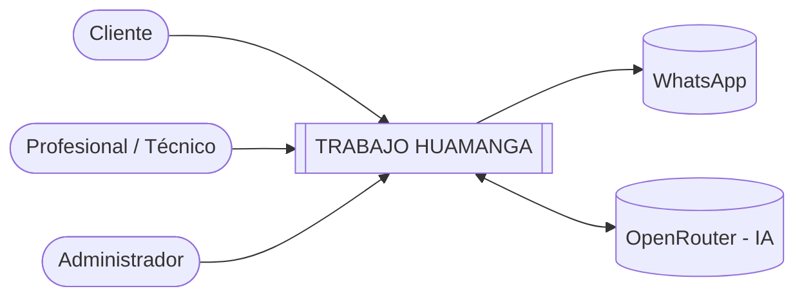

# 01 — Actores del sistema

Los actores son personas, organizaciones o sistemas externos que están **fuera del sistema** e interactúan con él para realizar una acción o intercambiar información.

## Actores humanos

| ID | Actor | Descripción | ¿Qué necesita realizar? |
|---|---|---|---|
| A01 | **Cliente** | Cualquier persona que necesita contratar un servicio en Huamanga (electricidad, gasfitería, reparación, tutoría, etc.), sin necesidad de vivir en un distrito específico. | Buscar profesionales por rubro, zona o nombre; consultar su reputación; contactarlos por WhatsApp; calificarlos y reportar perfiles o reseñas inapropiadas. |
| A02 | **Profesional / Técnico** | Persona independiente que ofrece un servicio en la ciudad. | Registrarse, crear y actualizar su perfil (rubro, zona de atención, contacto) y darse de baja del directorio. |
| A03 | **Administrador** | Responsable de operar y moderar la plataforma. | Revisar reportes, dar de baja perfiles o calificaciones falsas o inapropiadas, gestionar rubros y zonas, y consultar informes. |

## Sistemas externos

| ID | Actor | Tipo | ¿Qué necesita realizar? |
|---|---|---|---|
| A04 | **WhatsApp** | Sistema externo (canal de mensajería) | Recibir al cliente mediante un enlace directo (`wa.me`) hacia el número del profesional. |
| A05 | **OpenRouter** | Sistema externo (proveedor de modelos de lenguaje / IA) | Recibir la descripción libre de la necesidad del cliente y devolver el rubro sugerido. |

## Diagrama de contexto

