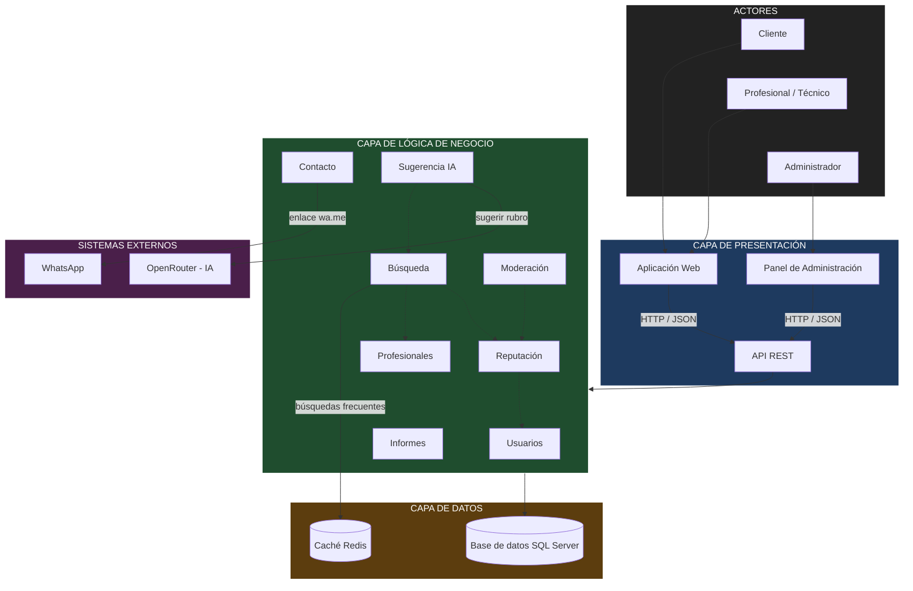

# Arquitectura inicial del sistema

## 1. Estilo arquitectónico

Se adopta una **arquitectura en capas** siguiendo los principios de **Clean Architecture**: cada capa tiene sus propias responsabilidades y las dependencias apuntan hacia la lógica de negocio. Esta decisión responde principalmente a **DA08 (mantenibilidad)** y **DA06 (API REST)**. La solución se despliega en **contenedores Docker** (DA07).

| Capa | Pregunta que responde | Responsabilidad |
|---|---|---|
| **Presentación** | ¿Cómo interactúa el usuario? | Aplicación web (búsqueda, perfiles, calificación), panel de administración y API REST que expone las operaciones. |
| **Lógica de negocio** | ¿Qué hace el sistema? | Reglas y procesos: registrar perfiles, buscar, calcular reputación, validar calificaciones, sugerir rubros, moderar. |
| **Datos** | ¿Dónde se almacena la información? | Persistencia de usuarios, profesionales, rubros, zonas, calificaciones y reportes; caché de búsquedas frecuentes. |

## 2. Módulos de la lógica de negocio

| Módulo | Responsabilidad | Requisitos que atiende |
|---|---|---|
| **Usuarios** | Registro, inicio de sesión y roles (cliente, profesional, administrador). | RF10, RF11 |
| **Profesionales** | Alta, edición y baja de perfiles con rubro, zona y contacto. | RF01, RF02 |
| **Búsqueda** | Búsqueda y filtrado por rubro, zona y nombre; uso de la caché. | RF03, RF04, RF05 |
| **Reputación** | Registro de calificaciones, cálculo del promedio y reglas antifraude. | RF06, RF07, RF08 |
| **Contacto** | Generación del enlace directo de WhatsApp. | RF09 |
| **Moderación** | Reportes de clientes y baja de perfiles o calificaciones. | RF12, RF13 |
| **Sugerencia IA** | Sugerencia de rubro a partir de la descripción del cliente. | RF14, RF15 |
| **Informes** | Rubros más buscados y zonas con poca oferta. | RF16, RF17 |

## 3. Dependencias entre módulos

- **Búsqueda** depende de **Profesionales** (perfiles activos) y de **Reputación** (promedio y número de reseñas).
- **Reputación** depende de **Usuarios** (cliente que califica) y de **Profesionales** (profesional calificado).
- **Moderación** depende de **Profesionales** y **Reputación** (al dar de baja una calificación se recalcula el promedio).
- **Contacto** depende de **Profesionales** (número de WhatsApp registrado).
- **Sugerencia IA** alimenta a **Búsqueda** con el rubro confirmado por el cliente.
- **Informes** depende de **Búsqueda** (historial de búsquedas) y de **Profesionales** (oferta por zona).

## 4. Integraciones con sistemas externos

| Sistema externo | Módulo que lo usa | Propósito | Driver |
|---|---|---|---|
| OpenRouter | Sugerencia IA | Obtener el rubro sugerido a partir de la descripción del cliente | DA05 |
| WhatsApp | Contacto | Derivar al cliente a una conversación con el profesional mediante `wa.me` | — (RC04) |

> **Decisión de diseño:** la integración con OpenRouter se realiza desde la **capa de lógica de negocio** a través de una interfaz (adaptador), con un tiempo límite de respuesta. Si la IA falla, el cliente elige el rubro manualmente y la búsqueda sigue funcionando (AC03). Con WhatsApp no existe integración bidireccional: solo se genera un enlace, por lo que no se procesan mensajes ni pagos.

## 5. Diagrama de arquitectura

## 6. Descripción

La arquitectura inicial se organiza en tres capas principales:

- **Presentación:** permite la interacción de los clientes y profesionales mediante la aplicación web, y del administrador mediante el panel de administración; ambos consumen la API REST.
- **Lógica de negocio:** contiene los módulos responsables de las funcionalidades del sistema: usuarios, profesionales, búsqueda, reputación, contacto, moderación, sugerencia IA e informes.
- **Datos:** almacena la información en una base de datos SQL Server y mantiene en Redis las búsquedas más frecuentes.

Además, el módulo de **Sugerencia IA** se integra con **OpenRouter** para recomendar el rubro, y el módulo de **Contacto** genera el enlace directo hacia **WhatsApp**.

## 7. Cómo responde la arquitectura a los drivers

| Driver | Respuesta en la arquitectura |
|---|---|
| DA01 Rendimiento | El módulo Búsqueda consulta primero la caché Redis y la base de datos tiene índices por rubro y zona. |
| DA02 Escalabilidad | La API REST es sin estado (JWT), por lo que puede replicarse detrás del proxy reverso. |
| DA03 Reputación confiable | El cálculo del promedio y las reglas antifraude se concentran en el módulo Reputación y se prueban con TDD. |
| DA04 Seguridad | La autenticación y los roles se centralizan en el módulo Usuarios; las contraseñas se almacenan con hash. |
| DA05 Integración con IA | OpenRouter se usa solo desde Sugerencia IA, mediante una interfaz con tiempo límite; si falla, la búsqueda continúa. |
| DA06 API REST | Toda comunicación entre la aplicación web, el panel y el backend pasa por la API REST. |
| DA07 Contenedores | Cada componente se ejecuta en su contenedor y se despliega con Docker Compose en cualquier proveedor. |
| DA08 Mantenibilidad | Las capas y módulos separan responsabilidades; un cambio en un módulo no obliga a modificar los demás. |
