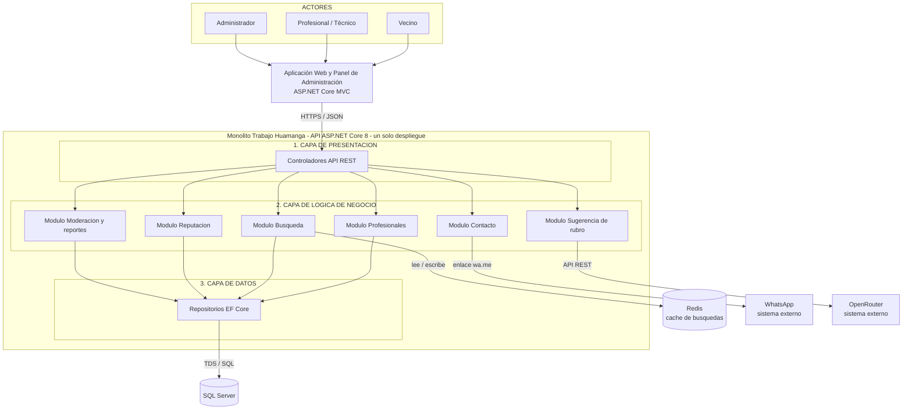

# Estilo arquitectónico - Trabajo Huamanga

## Estilo seleccionado

**Monolito modular en capas.**

- **Monolito:** la API se despliega como una sola aplicación (ASP.NET Core 8) con una única base de datos. Es la unidad de despliegue.
- **Modular:** internamente se organiza en módulos de negocio independientes (Profesionales, Búsqueda, Reputación, Contacto, Sugerencia de rubro y Moderación/Reportes).
- **En capas:** cada módulo separa presentación, lógica de negocio y datos.

Capas = organización lógica; monolito = unidad de despliegue. Pueden coexistir.

## Justificación

| Driver | Cómo lo responde el estilo |
| --- | --- |
| DA01 - Escalabilidad | La API no guarda estado, por lo que se despliega en varias réplicas detrás de un proxy reverso. |
| DA02 - Rendimiento | Una capa de caché (Redis) entre la lógica de negocio y la base de datos. |
| DA06 - Mantenibilidad | Los módulos se comunican por interfaces y no acceden a los datos de otro módulo. |

## Diagrama

## Reglas de la arquitectura

1. Cada capa solo invoca a la capa inmediatamente inferior.
2. Un módulo no accede a las tablas de otro módulo; usa su servicio.
3. La comunicación entre módulos se hace llamando a su interfaz.
4. Todo se ejecuta en un único proceso con una única base de datos.
5. WhatsApp y OpenRouter son sistemas externos, fuera del monolito.
