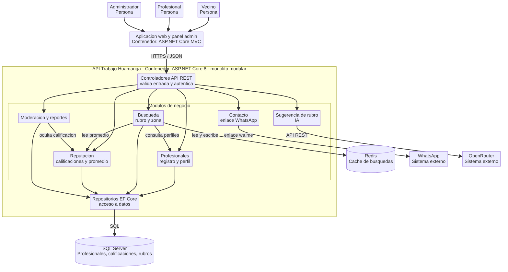
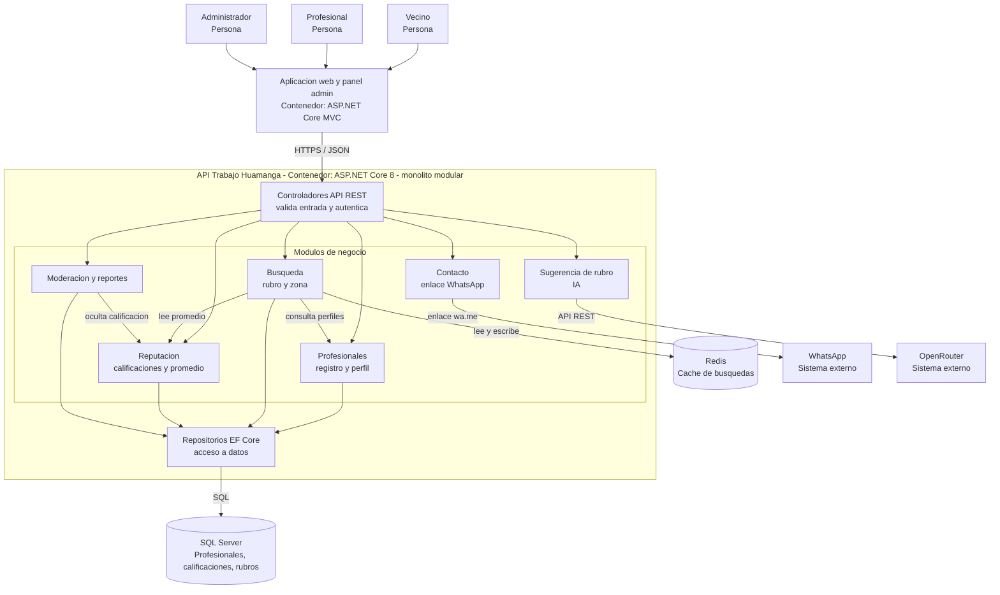

# Componentes arquitectónicos - Trabajo Huamanga

Vista de componentes (nivel 3 del modelo C4) de la API de Trabajo Huamanga. Estilo: monolito modular en capas.

Ver codigo Mermaid del diagrama

## Descripción de los componentes

| Componente | Responsabilidad | Requisito o driver del que sale |
| --- | --- | --- |
| Controladores API REST | Exponen los endpoints, validan la entrada y autentican al usuario. | DA05 - API REST |
| Profesionales | Registra y administra el perfil del profesional (rubro, zona, descripción). | Registro de profesionales |
| Búsqueda | Busca profesionales por rubro y zona y usa la caché. | DA02 - Rendimiento |
| Reputación | Registra calificaciones válidas y calcula el promedio. | DA03 - Seguridad e integridad |
| Contacto | Genera el enlace de WhatsApp para contactar al profesional. | DA04 - Integración externa |
| Sugerencia de rubro | Pide a la IA un rubro sugerido a partir de la descripción del problema. | DA04 - Integración externa |
| Moderación y reportes | Permite al administrador revisar reportes y ocultar calificaciones indebidas. | DA03 - Seguridad e integridad |
| Repositorios EF Core | Leen y escriben en SQL Server. | DA06 - Mantenibilidad |

## Reglas de interacción

1. Los controladores solo llaman a los módulos; no acceden a los datos directamente.
2. Un módulo usa a otro solo mediante su interfaz de servicio.
3. Redis y SQL Server solo son accedidos desde Búsqueda y los Repositorios.
4. WhatsApp y OpenRouter son sistemas externos y se usan mediante adaptadores.
