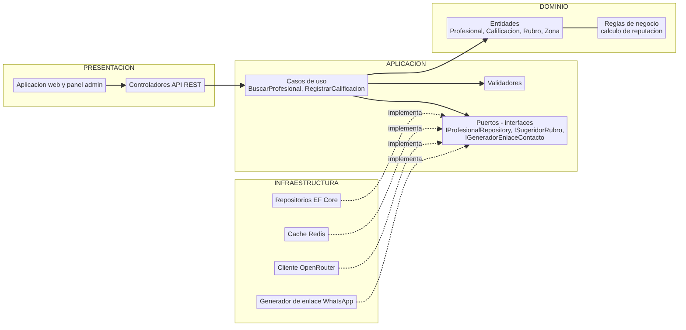
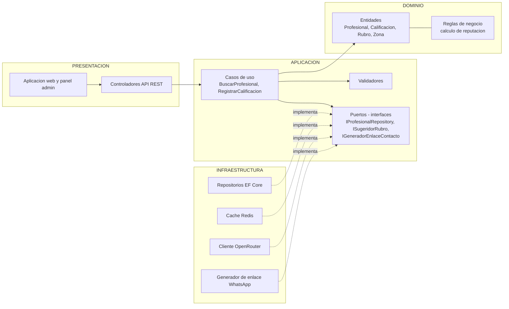

# Enfoque arquitectónico - Clean Architecture - Trabajo Huamanga

| Elemento | Descripción aplicada a Trabajo Huamanga |
| --- | --- |
| Patrón / enfoque arquitectónico | Clean Architecture (Arquitectura Limpia). |
| Objetivo | Separar responsabilidades y controlar las dependencias hacia el dominio. |
| ¿Qué problema resuelve? | Evita el acoplamiento entre la interfaz web, las reglas del negocio (reputación, validación de perfiles) y las tecnologías externas: SQL Server, Redis, WhatsApp y OpenRouter. |
| Capas definidas | Presentación, Aplicación, Dominio e Infraestructura. |
| Beneficios | Facilita el mantenimiento y las pruebas unitarias (clave para TDD). Permite cambiar implementaciones técnicas, como el proveedor de IA o la caché, sin modificar las reglas del negocio. Mejora la organización y la separación de responsabilidades del código. |

## Capas y su contenido

| Capa de Clean Architecture | ¿Qué contiene? | Ejemplo en Trabajo Huamanga |
| --- | --- | --- |
| Dominio | Entidades, objetos de valor y reglas de negocio. | Profesional, Calificación, Rubro, Zona; cálculo del promedio de reputación. |
| Aplicación | Casos de uso, puertos (interfaces) y validadores. | BuscarProfesional, RegistrarProfesional, RegistrarCalificación; interfaces IProfesionalRepository, ISugeridorRubro e IGeneradorEnlaceContacto. |
| Presentación | Controladores y vistas. | Controladores de la API REST, aplicación web y panel de administración. |
| Infraestructura | Implementaciones concretas de los puertos. | Repositorios con EF Core y SQL Server, caché Redis, cliente de OpenRouter y generador de enlace wa.me. |

## Regla de dependencia

Las dependencias del código apuntan siempre hacia el interior:

1. El **Dominio** no importa nada de las demás capas.
2. Los **casos de uso** (Aplicación) solo conocen las entidades y los contratos del dominio.
3. La **Infraestructura** implementa los contratos definidos en la Aplicación (inversión de dependencias).
4. Cambiar de tecnología (por ejemplo, de OpenRouter a otro proveedor) implica cambiar un adaptador de Infraestructura, no el dominio.

## Diagrama

Ver codigo Mermaid del diagrama

Leyenda: la flecha continua es una llamada en tiempo de ejecución; la flecha punteada es una implementación de un contrato definido en la capa interior.
