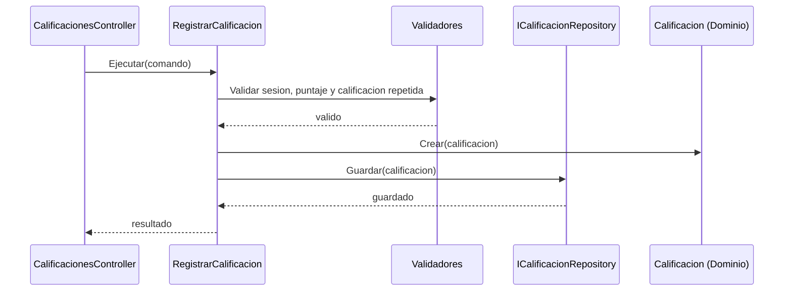

# Diseño interno de módulos - Trabajo Huamanga

Se detalla cómo se organiza por dentro cada módulo, siguiendo Clean Architecture (Dominio, Aplicación, Infraestructura y Presentación).

## Estructura de carpetas propuesta

```text
src/
  TrabajoHuamanga.Dominio/            entidades y reglas de negocio
  TrabajoHuamanga.Aplicacion/         casos de uso, interfaces y validadores
  TrabajoHuamanga.Infraestructura/    EF Core, Redis, OpenRouter, WhatsApp
  TrabajoHuamanga.Api/                controladores API REST
  TrabajoHuamanga.Web/                aplicación web y panel admin (MVC)
tests/
  TrabajoHuamanga.Pruebas/            pruebas unitarias (TDD)
```

## Módulo Reputación

| Elemento | Detalle |
| --- | --- |
| Entidades (Dominio) | `Calificacion` (puntaje, comentario, fecha, estado), `Profesional` |
| Reglas (Dominio) | El puntaje va de 1 a 5. Un vecino califica una sola vez por profesional. El promedio ignora las calificaciones ocultas. |
| Caso de uso (Aplicación) | `RegistrarCalificacion`, `ObtenerPromedioReputacion` |
| Interfaces (Aplicación) | `ICalificacionRepository`, `IProfesionalRepository` |
| Implementación (Infraestructura) | `CalificacionRepository` con EF Core |
| Presentación | `CalificacionesController` (`POST /api/calificaciones`) |

## Módulo Búsqueda

| Elemento | Detalle |
| --- | --- |
| Entidades (Dominio) | `Profesional`, `Rubro`, `Zona` |
| Caso de uso (Aplicación) | `BuscarProfesional` (rubro, distrito, orden por reputación) |
| Interfaces (Aplicación) | `IProfesionalRepository`, `ICacheBusqueda` |
| Implementación (Infraestructura) | `ProfesionalRepository` (EF Core), `CacheBusquedaRedis` |
| Presentación | `ProfesionalesController` (`GET /api/profesionales?rubro=&distrito=`) |

## Módulo Sugerencia de rubro

| Elemento | Detalle |
| --- | --- |
| Caso de uso (Aplicación) | `SugerirRubro` |
| Interfaz (Aplicación) | `ISugeridorRubro` |
| Implementación (Infraestructura) | `SugeridorRubroOpenRouter` (adaptador), `SugeridorRubroManual` (alternativa si la IA falla) |
| Presentación | `RubrosController` (`POST /api/rubros/sugerir`) |

## Módulo Contacto

| Elemento | Detalle |
| --- | --- |
| Caso de uso (Aplicación) | `GenerarEnlaceContacto` |
| Interfaz (Aplicación) | `IGeneradorEnlaceContacto` |
| Implementación (Infraestructura) | `GeneradorEnlaceWhatsApp` (arma el enlace `https://wa.me/<numero>`) |

## Flujo interno: registrar una calificación



## Dependencias permitidas

- Dominio no depende de ninguna otra capa.
- Aplicación depende solo de Dominio.
- Infraestructura depende de Aplicación y Dominio.
- Presentación depende de Aplicación.
