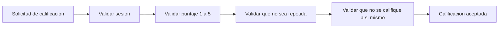

# Patrones de diseño - Trabajo Huamanga

Los patrones se eligieron por el problema concreto que resuelven en el proyecto, no por cantidad.

| Patrón | Problema que resuelve en el proyecto | Dónde se aplica | Driver |
| --- | --- | --- | --- |
| Repository | Evita que la lógica de negocio conozca EF Core y SQL Server. | `IProfesionalRepository`, `ICalificacionRepository` | DA06 |
| Adapter | La API de OpenRouter tiene una interfaz distinta a la que necesita el sistema. | `SugeridorRubroOpenRouter` implementa `ISugeridorRubro` | DA04, DA06 |
| Circuit Breaker | Si OpenRouter falla, no se debe seguir llamándolo y bloquear la búsqueda. | Llamadas a OpenRouter (por ejemplo, con la biblioteca Polly) | DA04 |
| Chain of Responsibility | Una calificación pasa por varias validaciones en orden. | Validadores de `RegistrarCalificacion` | DA03 |

## Repository

**Problema:** si los casos de uso usan EF Core directamente, cambiar la base de datos o probar sin ella es difícil.
**Solución:** los casos de uso dependen de una interfaz y la implementación vive en Infraestructura.

```csharp
public interface IProfesionalRepository
{
    Task<IReadOnlyList<Profesional>> BuscarAsync(string rubro, string distrito);
}
```

## Adapter

**Problema:** el sistema necesita sugerir un rubro, pero cada proveedor de IA expone una API distinta.
**Solución:** un adaptador traduce la llamada del sistema a la API del proveedor. Cambiar de proveedor significa escribir otro adaptador.

```csharp
public interface ISugeridorRubro
{
    Task<string> SugerirAsync(string descripcionProblema);
}

public class SugeridorRubroOpenRouter : ISugeridorRubro
{
    public async Task<string> SugerirAsync(string descripcionProblema)
    {
        // llama a la API de OpenRouter y devuelve el rubro sugerido
    }
}
```

## Circuit Breaker

**Problema:** si OpenRouter no responde, cada solicitud espera hasta agotar el tiempo y la plataforma se vuelve lenta.
**Solución:** tras varios fallos seguidos se bloquean las llamadas por un tiempo y se usa la alternativa manual (ver EQ-04).

## Chain of Responsibility

**Problema:** validar una calificación requiere varias reglas (sesión iniciada, puntaje válido, no repetida, no es el mismo profesional) y no conviene un método enorme con muchos `if`.
**Solución:** cada regla es un validador independiente y la solicitud pasa por la cadena; si uno falla, se rechaza.



## Patrones considerados y no usados

| Patrón | Motivo |
| --- | --- |
| Facade | Los controladores ya llaman a un caso de uso por operación; no hay varios subsistemas que ocultar. |
| CORS | Se aplicará solo si el frontend se sirve desde un origen distinto al de la API. |
