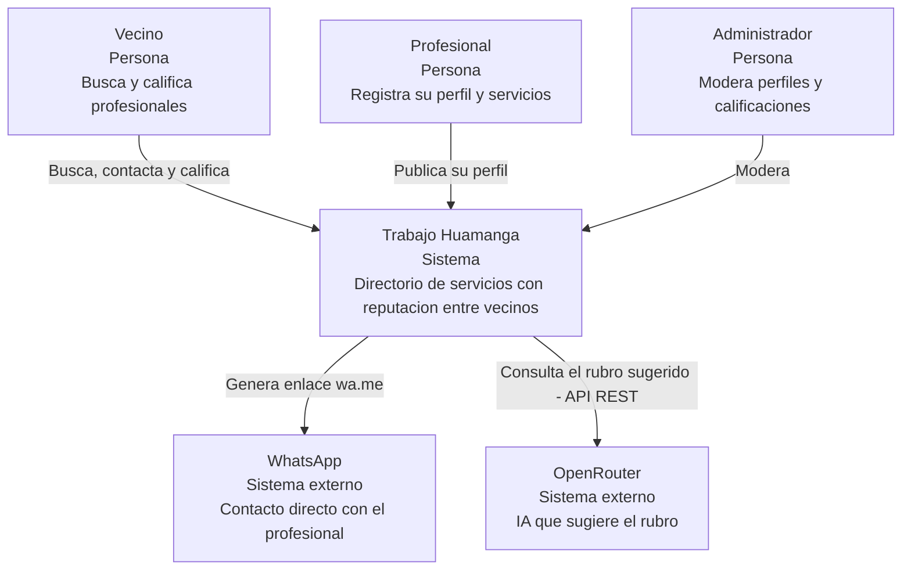

# C4 - Nivel 1: Diagrama de contexto del sistema - Trabajo Huamanga

Muestra el sistema en su entorno: quiénes lo usan y con qué sistemas externos se relaciona.

| Elemento | Descripción |
| --- | --- |
| Vecino | Persona de Huamanga que busca un servicio, contacta al profesional y deja una calificación. |
| Profesional | Persona que ofrece servicios (electricista, gasfitero, tutor, etc.) y mantiene su perfil. |
| Administrador | Revisa reportes y oculta calificaciones o perfiles indebidos. |
| Trabajo Huamanga | Sistema que se construye. |
| WhatsApp | Sistema externo usado para el contacto. |
| OpenRouter | Sistema externo de IA usado para sugerir el rubro. |
