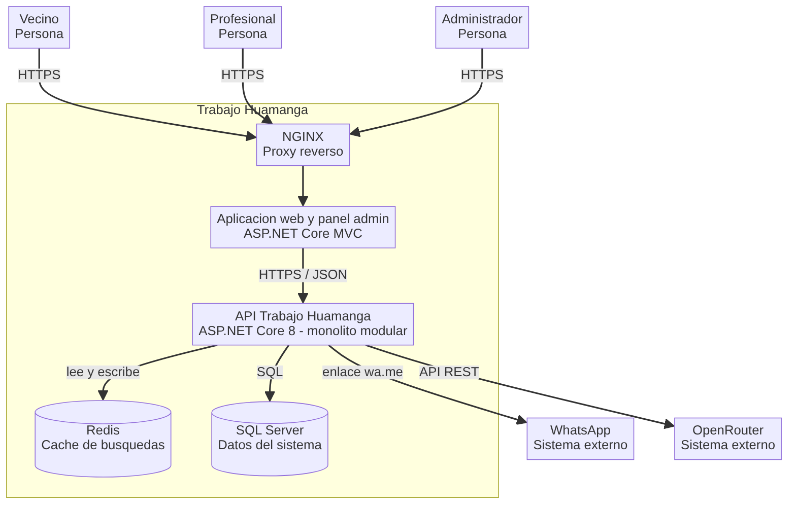
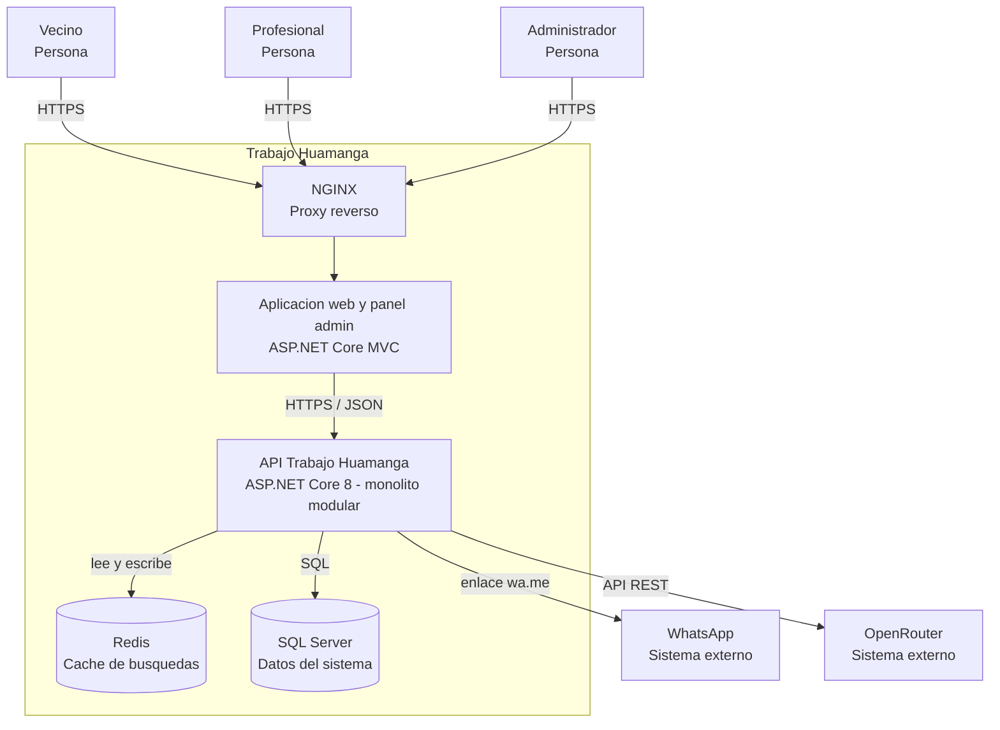

# C4 - Nivel 2: Diagrama de contenedores - Trabajo Huamanga

Muestra las aplicaciones y almacenes de datos que componen el sistema.

Ver codigo Mermaid del diagrama

| Contenedor | Tecnología | Responsabilidad |
| --- | --- | --- |
| NGINX | NGINX en Docker | Recibe las solicitudes y las reparte entre las réplicas. |
| Aplicación web y panel admin | ASP.NET Core MVC | Interfaz de vecinos, profesionales y administrador. |
| API Trabajo Huamanga | ASP.NET Core 8, EF Core | Reglas de negocio y acceso a datos. Sin estado, escalable en réplicas. |
| Redis | Redis | Caché de las búsquedas frecuentes. |
| SQL Server | SQL Server | Profesionales, calificaciones, rubros y zonas. |

Todos los contenedores propios se despliegan con Docker.
