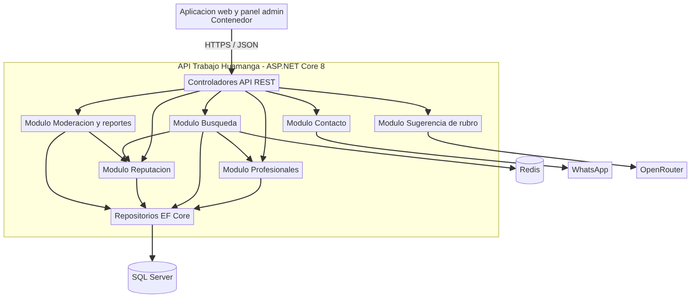
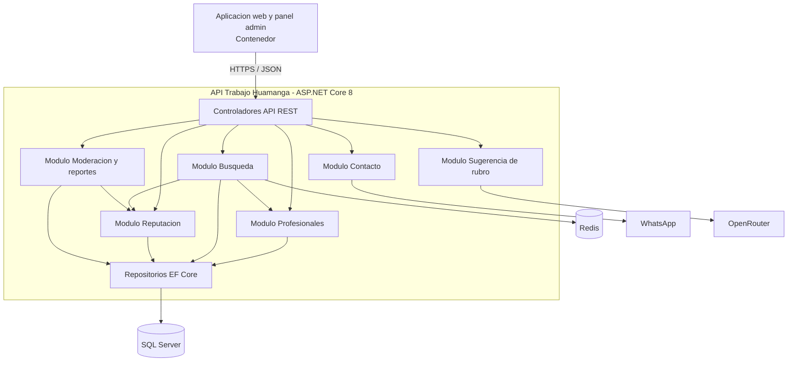

# C4 - Nivel 3: Diagrama de componentes - Trabajo Huamanga

Muestra los componentes dentro del contenedor **API Trabajo Huamanga**.

Ver codigo Mermaid del diagrama

La descripción de cada componente y sus reglas de interacción están en [componentes-arquitectonicos.md](../02-arquitectura-software/componentes-arquitectonicos.md).
