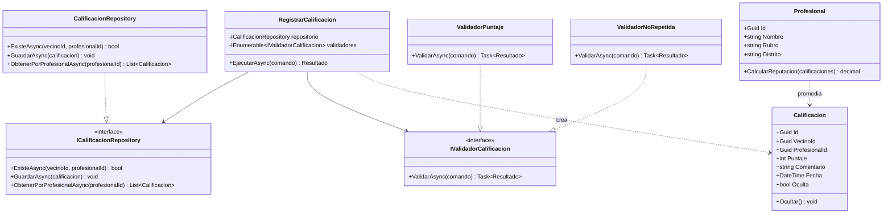

# C4 - Nivel 4: Diagrama de código - Trabajo Huamanga

Muestra la estructura interna del componente **Reputación**, caso de uso `RegistrarCalificacion`.

| Clase | Capa | Responsabilidad |
| --- | --- | --- |
| `RegistrarCalificacion` | Aplicación | Orquesta el caso de uso. |
| `IValidadorCalificacion` y validadores | Aplicación | Reglas de validación en cadena. |
| `Calificacion`, `Profesional` | Dominio | Entidades y regla del promedio de reputación. |
| `ICalificacionRepository` | Aplicación | Contrato de acceso a datos. |
| `CalificacionRepository` | Infraestructura | Implementación con EF Core y SQL Server (el boilerplate usa una versión en memoria). |
